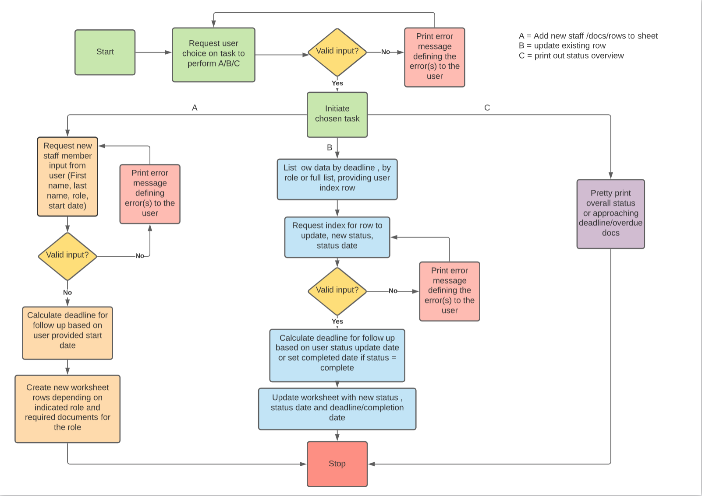
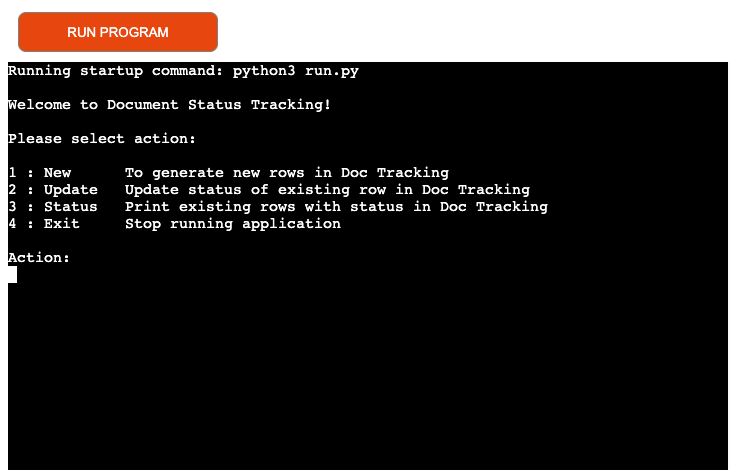
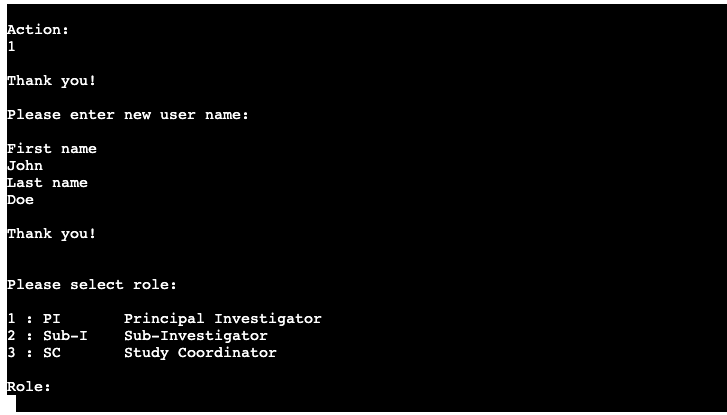
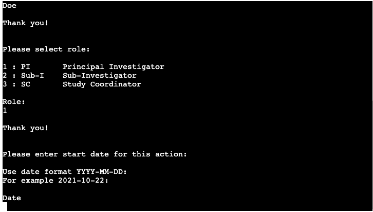
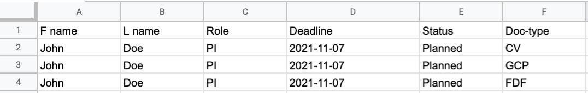
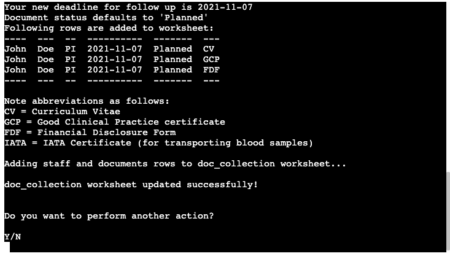

# Ultimate Document Tracking

## Intro

Document tracking is a Python Terminal application which runs in the Code Institute mock terminal on Heroku.

The application is intended for Document tracking for various site staff roles within Pharmaceutical Clinical Trials and can be used to facilitate document tracking in gspread by adding rows applicable for the given input.

The live site can be found [here](https://portfolio-3rd.herokuapp.com/)

## Design

### Application Workflow
Below is a high level overview of the workflow through the application.

### User Stories
-  __As a user of the application, I want to be able to:__
    - Add new site staff and have applicable documents with corresponding rows added to my gspread worksheet.
    - Get the follow up deadline calculated and presented to me.
    - Update existing rows woth a new status and have a new deadline calculated and presented to me.
    - Have an intuitive UI that makes it clear what operations I can perform and what input is expected from me.
    - Make chioices and enter input quickly, without having to type more than neccesary.
    - Have available data presented to me.

### Audience
The intended audience is anyone working with spreadsheet document tracking in clinical trials and would benefit from an automated process of adding and updating the sheet.

## Features

### Existing features

#### Main menu
- Presents user with available options with explanations. Validates input and provides user feedback for invalid data.

#### Generate new rows in worksheet
- Requests user input for first name, last name, role and start date, and validates all provided input. Provides user feedback for invalid data.

- Based on user input for start date, a deadline date of start date + 15 days is calculated.

- Based on user input, new rows are generated in the worksheet. Different roles have different document type requirements.

- Feedback is provided in the terminal listing the calculated deadline, details of rows added and explanation of used abbreviations.

- Requests user to chose whether to perform another action or close application.

#### Update status and date of existing rows in worksheet
- Based on user input, tabulated lists are printed. These are filtered by role, by deadline in less than 7 or all existing rows.
- Based on user input, document status and new deadline for follow up is updated in the worksheet.

### Overview status of all rows
- The status option allows the user to see a tabulated list of all existing rows in the worksheet for overview.

### Future Features

## Testing

###
# Testing
## User Story Testing
-  __User Features Requested:__
    - Request: Add new site staff and have applicable documents with corresponding rows added to my gspread worksheet.
        - Result: The user can choose the option "New", enter the new site staff data (name, role and start date) and have their worksheet upated with corresponding rows for each required document.
    - Request: Get the follow up deadline calculated and presented to me.
        - Result: The application automatically returns a deadline calculated as the start date plus 15 days. It is printed tp the terminal and added to each new row in the worksheet.
    - Request: Update existing rows woth a new status and have a new deadline calculated and presented to me.
        - Result: The user can choose the option "Update", filter by role, by deadline or see all existing rows in the worksheet, and update the status of a chosen row. A new deadline will automatically be calculated and presented.
    - Request: Have an intuitive UI that makes it clear what operations I can perform and what input is expected from me.
        - Result: The application has a clear menu and user prompts, presenting each option (where applicable) with a short explanation. Abbreviations which are not immediately clear are explained.
    - Request: Make choices and enter input quickly, without having to type more than neccesary.
        - Result: The application uses numbered options where possible to reduce the amount of typing for the user.
    - Request: Have available data presented to me.
        - Result: The user can choose the option "Status" which prints a tabulated data to the terminal, giving an overview of the available data from the worksheet. The option "Update" also prints tabulated data based on user's preferred filter.

## Application Testing

For testing, print statements were used heavily during the coding of the application. Once finished, every paths was navigated to ensure they gave the expected result and validation of each user input was working.

- The menu input option checks for valid user input and prompts the user to input a valid choice if one is not entered

- Entering user name containing symbols or numbers prompt user to enter an alphabetic name.

- Entering user name less than 2 or more than 15 characters prompts the user to enter a name of valid length.

- Selecting a number not corresponding to a role or entering a letter or symbol prompts user select one of the given options.

- Entering a start date that is in the future prompts the user to enter a valid start date.

- Entering a start date the is more than 15 days in the part (i.e. deadline has already passed) warns the user that deadline has passed but allowd the date to be entered.

- Selecting a number not corresponding to a filter or entering a letter or symbol prompts user select one of the given options.

- Selecting a row which is not present in the list promts the user to select a valid row to update.

- Selecting a number not corresponding to a document status or entering a letter or symbol prompts user select one of the given options.

- Entering a character not matching the given options will prompt the user to pick one of the given options. Lower case letters y/n are accepted.

## Validation
All code has been run through the [PEP8](http://pep8online.com) online checker to validate the Python code.

## Data model

## Technologies

### Languages

- [Python](https://en.wikipedia.org/wiki/Python_(programming_language))

### Other Technologies and Libraries

- [GitHub](https://github.com/)
- [Git](https://gitforwindows.org/)
- [Heroku](https://heroku.com)
- [Lucidcharts](https://www.lucidchart.com/)
    - Used to create the flow chart.
- [Google Cloud Platform](https://cloud.google.com/)
- [Google Sheets](https://www.google.com/sheets/about/)
    - The online spreadsheet.
- [GSpread API Reference](https://docs.gspread.org/en/latest/api.html)
    - The API reference for the GSpread library for Python. Required for the GSpread worksheet connection.It provides an easy interface for working with Google Sheets from code.
- [Tabulate](https://pypi.org/project/tabulate/)
    - Required to print tabular data in nicely formatted tables for improved UI.
- [Datetime, including timedelta](https://docs.python.org/3/search.html?q=datetime&check_keywords=yes&area=default)
    - Required to convert date to string and vice versa, and to calculate deadlines.

## Bugs & Fixes
- Calculated deadline could not be inserted in worksheet, solved by converting the date back to string format before insertion (https://github.com/burnash/gspread/issues/511)
- After updating user choice input to numbers (instead of typing out the role abbreviation) for choosing a role, the number was added to worksheet instead of the role. Solved by converting the role variable back to role abbreviation before adding it to the list to be inserted to the worksheet.

## Deployment

### Creating App

1. To import the required dependencies to the requirements.txt file, type the following in the terminal:
    > pip3 freeze > requirements.txt
    - Heroku will use this file to import the dependencies that are required.
2. Log into or sign up to Heroku.
3. On the dashboard, select "Create new app" from the drop-down menu (upper right corner) or the button mid-page.
6. Provide a name for your application (this needs to be unique) and select your region.
7. Click "Create App".

### Update settings

1. Navigate to "Settings" and scroll down to "config vars".
2. For the first row: for key: type "CREDS" and for value: copy and paste the content of the creds.json file. Click "add".
3. For the second row in config vars: for key: type "PORT" and for value type: "8000". Click add.
4. Scroll down to "build packs".
5. Click "build packs" and then add both "python" and "node.js" - in that particular order.

### App Deployment

1. Navigate to the "Deploy" section.
2. Scroll down to "Deployment Method" and select "GitHub".
3. Authorize the connection of Heroku to GitHub.
4. Search for your GitHub repository name (portfolio-3rd), and select the repository.
5. For Deployment there are two options, Automatic Deployments or Manual.
    - Automatic Deployment: This will prompt Heroku to re-build your app each time you push your code to GitHub.
    - Manual Deployment: This will only prompt Heroku to build your app when you manually tell it to do so.
6. Ensure the correct branch is selected "master/Main", and select the deployment method that you desire. In this case, I will be using Automatic Deployment.

## Credits

All code has been custom written for this project, with the exception of the scope and constant variables (from the Love Sandwiches walkthrough project, as the Gspread set up was identical) and the basis for the while loop and user input validation (also from the Love Sandwiches walkthrough project, but customized for each function and purpose in this project).

Other inspiration and tutoritals are credited as per below:

- [Code Institute Template](https://github.com/Code-Institute-Org/python-essentials-template)

- How to validate a date string [Date String Validation](https://www.kite.com/python/answers/how-to-validate-a-date-string-format-in-python)

- How to calculate timedelta [Timedelta calculations](https://stackoverflow.com/questions/151199/how-to-calculate-number-of-days-between-two-given-dates)

- How to convert dates to strings and vice versa [Datestring convertions](https://stackabuse.com/converting-strings-to-datetime-in-python/)

- While loop and user input validation:
    - The basis for the while loop for user input and the corresponding validation function were taken from the Love Sandwiches walkthrough project. All code has been customized for the indented purposes for this project.

- Scope and constant variables:
    - Scope and constant variables were taken from the Love Sandwiches walkthrough project as the Gspread set up was identical.

