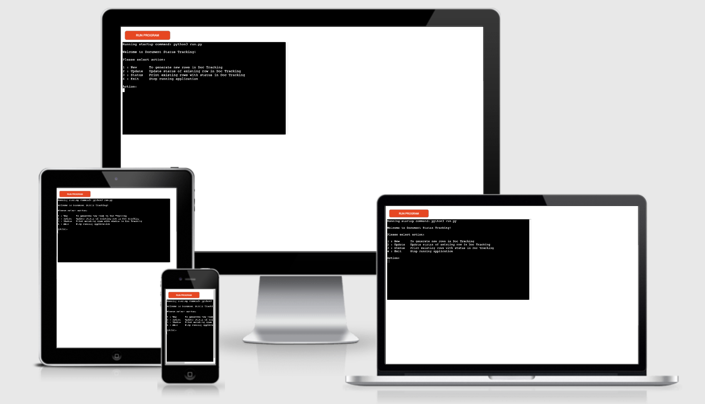
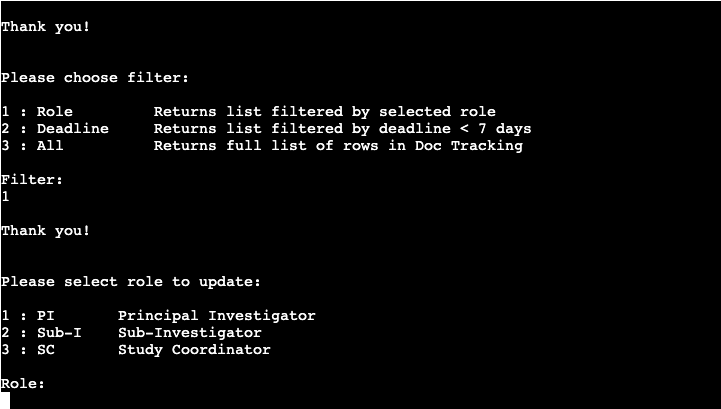
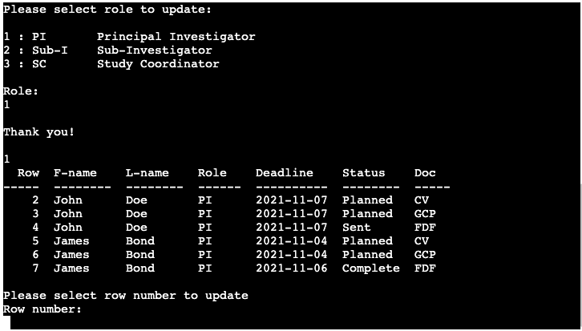
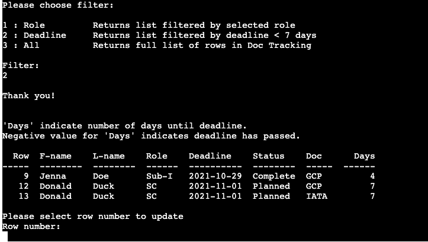
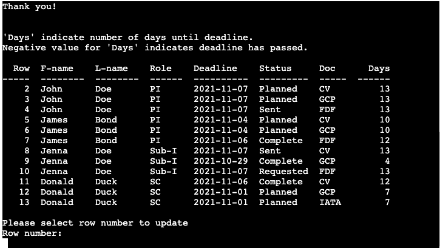
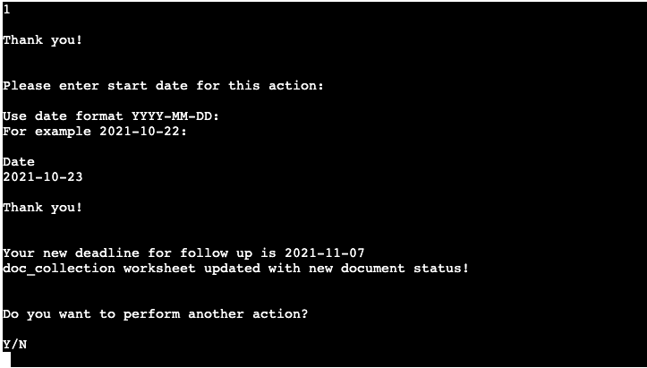
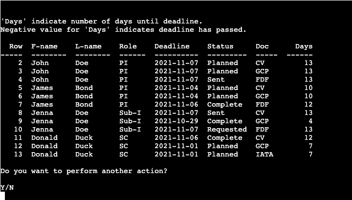
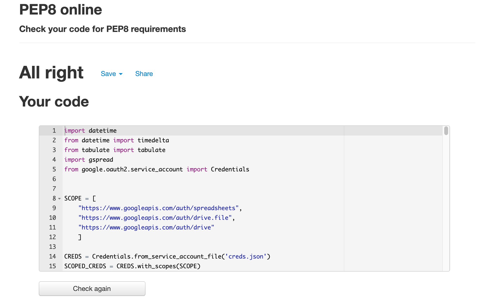

# Document Tracking

## Intro

Document tracking is a Python Terminal application that runs in the Code Institute mock terminal on Heroku.

The application is intended for Document tracking for various site staff roles within Pharmaceutical Clinical Trials and can be used to facilitate document tracking in gspread by adding rows applicable for the given input and by updating existing rows with new status and deadline.

The live site can be found [here](https://portfolio-3rd.herokuapp.com/)

## Design

### Application Workflow
Below is a high-level overview of the workflow through the application.

### User Stories
-  __As a user of the application, I want to be able to:__
    - Add new site staff and have applicable documents with corresponding rows added to my gspread worksheet.
    - Get the follow-up deadline calculated and presented to me.
    - Update existing rows with a new status and have a new deadline calculated and presented to me.
    - Have an intuitive UI that makes it clear what operations I can perform and what input is expected from me.
    - Make choices and enter input quickly, without having to type more than necessary.
    - Have available data presented to me.

### Audience
The intended audience is anyone working with spreadsheet document tracking in clinical trials and would benefit from an automated process of adding and updating the sheet.

## Features

### Existing features

#### Main menu:

Presents the user with available options with explanations. Validates input and provides user feedback for invalid data.

#### Generate new rows in the worksheet:

Requests user input for first name, last name, role and start date, and validates all provided input. Provides user feedback for invalid data.

Based on user input for the start date, a deadline date of start date + 15 days is calculated.

Based on user input, new rows are generated in the worksheet. Different roles have different document type requirements.

Feedback is provided in the terminal listing the calculated deadline, details of rows added and explanation of used abbreviations.

The user is requested to choose whether to perform another action or close the application.

#### Update status and date of existing rows in the worksheet:
Based on user input, tabulated lists are printed.
These are filtered by role:

by deadline in less than 7 days (explanation indicates that negative values for deadline days mean that the deadline is already overdue.):

or all existing rows:

Based on user input, document status and new date; deadline for follow-up is updated in the worksheet and feedback is printed to the terminal.

### Overview status of all rows
- The status option allows the user to see a tabulated list of all existing rows in the worksheet for overview.

### Future Features

## Testing

### User Story Testing
-  __User Features Requested:__
    - Request: Add new site staff and have applicable documents with corresponding rows added to my gspread worksheet.
        - Result: The user can choose the option "New"; enter the new site staff data (name, role, and start date) and have their worksheet updated with corresponding rows for each required document.
    - Request: Get the follow-up deadline calculated and presented to me.
        - Result: The application automatically returns a deadline calculated as the start date plus 15 days. It is printed to the terminal and added to each new row in the worksheet.
    - Request: Update existing rows with a new status and have a new deadline calculated and presented to me.
        - Result: The user can choose the option "Update", then filter by role, by deadline or see all existing rows in the worksheet, and update the status of a chosen row. A new deadline will automatically be calculated and presented.
    - Request: Have an intuitive UI that makes it clear what operations I can perform and what input is expected from me.
        - Result: The application has a clear menu and user prompts, presenting each option (where applicable) with a short explanation. Abbreviations that are not immediately clear are explained.
    - Request: Make choices and enter input quickly, without having to type more than necessary.
        - Result: The application uses numbered options where possible to reduce the amount of typing for the user.
    - Request: Have available data presented to me.
        - Result: The user can choose the option "Status" which prints tabulated data to the terminal, giving an overview of the available data from the worksheet. The option "Update" also prints tabulated data based on the user's preferred filter.

### Application Testing

For testing, every path and option was navigated to ensure they give the expected result and validation of each user input is working.

Input validation matrix can be found [here](assets/images/input_validation_matrix.png)

- All inputs require data; empty input data will generate an error message.

- Selecting main menu option:
    - Selecting a number from the main menu not corresponding to an option or entering a letter or symbol prompts user to select one of the given options.

- Entering new names:
    - Entering new names containing symbols or numbers prompts the user to enter a name consisting of letters only. For the purpose of this project, characters such as hyphens are not allowed.

    - Entering a new name of invalid length prompts the user to enter a name of valid length. For the purpose of this project, first name and last name must be 2-15 letters respectively.

- Selecting role option:
    - Selecting a number not corresponding to a role option or entering a letter or symbol prompts the user to select one of the given options.

- Entering date:
    - Entering a start date that is in the future prompts the user to enter a valid start date.

    - Entering a start date the is more than 15 days in the part (i.e. deadline has already passed) warns the user that the deadline has passed but allows the date to be entered.

-  Selecting filter option:
    - Selecting a number not corresponding to a filter or entering a letter or symbol prompts the user to select one of the given options.

- Selecting row to update:
    - Selecting a row that is not present in the printed list prompts the user to select a valid row to update.

- Selection new status:
    - Selecting a number not corresponding to a document status or entering a letter or symbol prompts the user to select one of the given options.

- Selecting whether to perform another action:
    - Entering a character not matching the given options will prompt the user to pick one of the given options. Lower case letters y/n are accepted.

### Validation
All code has been run through the [PEP8](http://pep8online.com) online checker to validate the Python code. No issues were found.

## Data model
The application user enters data directly in the terminal based on input prompts. The initial data is appended to a list of strings, manipulated, (for example additional list items added based on user inputs) and stored in separate rows in the connected Gspread spreadsheet.
From the spreadsheet, data is pulled and manipulated (for example row numbers are added) and presented back to the user in the terminal via tabulated print statements.

When data in the spreadsheet is to be updated, data is pulled from the sheet, manipulated based on user input (for example, row to update, new document status), and added back to the spreadsheet.

## Technologies

### Languages

- [Python](https://en.wikipedia.org/wiki/Python_(programming_language))

### Other Technologies and Libraries

- [GitHub](https://github.com/)
- [Git](https://gitforwindows.org/)
- [Heroku](https://heroku.com)
- [Lucidcharts](https://www.lucidchart.com/)
    - Used to create the flow chart.
- [Google Cloud Platform](https://cloud.google.com/)
- [Google Sheets](https://www.google.com/sheets/about/)
    - The online spreadsheet.
- [GSpread API Reference](https://docs.gspread.org/en/latest/api.html)
    - The API reference for the GSpread library for Python. Required for the GSpread worksheet connection. It provides an interface for working with Google Sheets from code.
- [Tabulate](https://pypi.org/project/tabulate/)
    - Required to print tabular data in nicely formatted tables for improved UI.
- [Datetime, including timedelta](https://docs.python.org/3/search.html?q=datetime&check_keywords=yes&area=default)
    - Required to convert date to string and vice versa, and to calculate deadlines.

## Bugs & Fixes
- Calculated deadline could not be inserted in the worksheet, solved by converting the date back to string format before insertion  [Reference](https://github.com/burnash/gspread/issues/511)
- After updating user choice input to numbers (instead of typing out the role abbreviation) for choosing a role, the number was added to the worksheet instead of the role. Solved by converting the role variable back to role abbreviation before adding it to the list to be inserted into the worksheet.
- Validation for the row number did not work, solved by converting number input to integer before comparing to list of available row numbers.

## Deployment

### Project Creation
The project was created using the CI Gitpod Python Essentials template
1. Navigate to CI Gitpod Full Template [here](https://github.com/Code-Institute-Org/python-essentials-template) and click the "Use this template" button.
2. Enter chosen repository name, then click "Create repository from template".
3. Navigate to the new repository on GitHub and click the Gitpod button to build the workspace.
4. The following commands were used for version control throughout the project:

- git add filename - to add files to the staging area before committing.
- git commit -m "commit message" - to commit changes to the local repository.
- git push - to push committed changes to the GitHub repository.

5. The creds.json file was added to gitignore to prevent sensitive data to be pushed to GitHub.

### Local Deployment/Clone
As described on [GitHub Docs](https://docs.github.com/en/repositories/creating-and-managing-repositories/cloning-a-repository)

1. Navigate to the GitHub Repository main page,
2. Above the list of files, click the Code drop-down menu.
3. To clone the repository using HTTPS, under "Clone with HTTPS", click the icon. To clone a repository using GitHub CLI, click Use GitHub CLI, then click the icon.
4. Open Terminal.
5. Change the current working directory to the location where you want the cloned directory.
6. Type git clone, and then paste the URL you copied earlier.
7. Press Enter to create your local clone.
8. To install Python module dependencies:
Open a terminal to the folder you have copied the code to.
Run the command pip install -r requirements.txt

### Fork project
This is used to propose changes to someone else's project or to use someone else's project as a starting point for your own idea.

1. Navigate to the GitHub Repository you want to fork.
2. On the top right of the page under the header, click "Fork".

This will create a duplicate of the full project in your GitHub Repository.

### Remote Deployment Heroku

#### Creating App

1. To import the required dependencies to the requirements.txt file, type the following in the terminal:
    > pip3 freeze > requirements.txt
    - Heroku will use this file to import the dependencies that are required.
2. Log into or sign up to Heroku.
3. On the dashboard, select "Create new app" from the drop-down menu (upper right corner) or the button mid-page.
6. Provide a name for your application (this needs to be unique) and select your region.
7. Click "Create App".

#### Update settings

1. Navigate to "Settings" and scroll down to "config vars".
2. For the first row: for key: type "CREDS" and for value: copy and paste the content of the creds.json file. Click "add".
3. For the second row in config vars: for key: type "PORT" and for value type: "8000". Click add.
4. Scroll down to "build packs".
5. Click "build packs" and then add both "python" and "node.js" - in that particular order.

#### App Deployment

1. Navigate to the "Deploy" section.
2. Scroll down to "Deployment Method" and select "GitHub".
3. Authorize the connection of Heroku to GitHub.
4. Search for your GitHub repository name (portfolio-3rd), and select the repository.
5. For Deployment there are two options, Automatic Deployments or Manual.
    - Automatic Deployment: This will prompt Heroku to re-build your app each time you push your code to GitHub.
    - Manual Deployment: This will only prompt Heroku to build your app when you manually tell it to do so.
6. Ensure the correct branch is selected "master/Main", and select the deployment method that you desire. In this case, I will be using Automatic Deployment.

## Credits

All code has been custom written for this project, except for the scope and constant variables (from the Love Sandwiches walkthrough project, as the Gspread set up was identical) and the basis for the while loop and user input validation (also from the Love Sandwiches walkthrough project, but customized for each function and purpose in this project).

Other inspiration and tutorials are credited as per below:

- [Code Institute Template](https://github.com/Code-Institute-Org/python-essentials-template)

- How to validate a date string [Date String Validation](https://www.kite.com/python/answers/how-to-validate-a-date-string-format-in-python)

- How to calculate timedelta [Timedelta calculations](https://stackoverflow.com/questions/151199/how-to-calculate-number-of-days-between-two-given-dates)

- How to convert dates to strings and vice versa [Datestring convertions](https://stackabuse.com/converting-strings-to-datetime-in-python/)

- While loop and user input validation:
    - The basis for the while loop for user input and the corresponding validation function was taken from the Love Sandwiches walkthrough project. The code has been customized for the intented validation purposes for this project.

- Scope and constant variables:
    - Scope and constant variables were taken from the Love Sandwiches walkthrough project as the Gspread set-up was identical.

